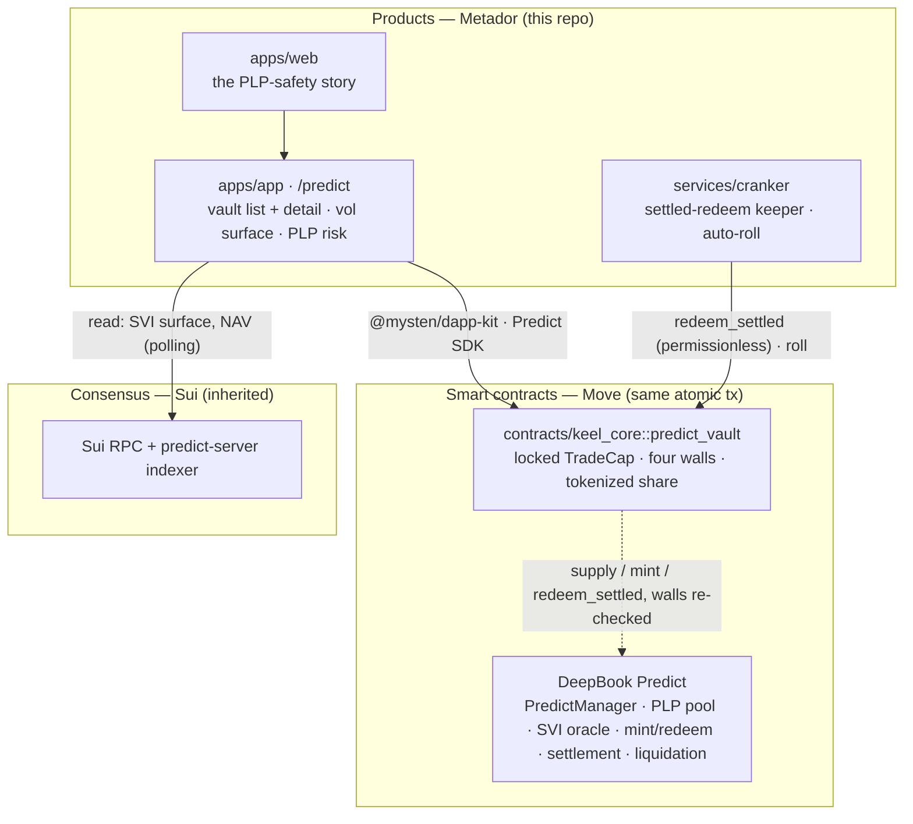

<div align="center">

# Metador

### The non-custodial **vault layer for DeepBook Predict** on Sui

**PLP yield, minus the crash.** Metador is a tokenized-share vault that runs a
PLP + crash-hedge strategy on DeepBook Predict's vol-surface-priced markets, under
chain-enforced four-walls policy. DeepBook Predict owns pricing, settlement, and
liquidation. Metador owns the vault, the policy, the tokenized share, the keeper,
and the risk presentation — so an outside LP gets auditable, composable Predict
exposure without the naked left-tail and without trusting an operator.

[](https://sui.io)
[](https://deepbook.tech)
[](https://nextjs.org)
[](https://www.typescriptlang.org)
[](https://turbo.build)
[](#status--safety)

</div>

---

## Table of contents

- [The problem](#the-problem)
- [What Metador is](#what-metador-is)
- [Layer guardrail — what we build vs. what Predict owns](#layer-guardrail)
- [The four walls, re-pointed at Predict](#the-four-walls-re-pointed-at-predict)
- [Architecture](#architecture)
- [The PLP + Hedge simulation](#the-plp--hedge-simulation)
- [Money-safety law](#money-safety-law)
- [Repository layout](#repository-layout)
- [Getting started](#getting-started)
- [Hackathon: how we meet the DeepBook Predict track](#hackathon-how-we-meet-the-deepbook-predict-track)
- [How this was built — KAIOS](#how-this-was-built--kaios)
- [Status & safety](#status--safety)
- [License & originality](#license--originality)

## The problem

DeepBook **Predict** is a programmable, vol-surface-priced prediction/options market
on Sui, with an on-chain pool — **PLP** — that takes the other side of every trade.
PLP earns the pool's premium flow, but raw PLP carries a **naked left tail**: a sharp
move can hand a cycle's losses straight to LPs. That tail is exactly what makes PLP a
hard sell to serious outside capital — and there is **no consumer vault on top of
Predict** that manages it.

## What Metador is

A vault that supplies the bulk of its capital to PLP and spends a small slice each
cycle on out-of-the-money binaries that pay off in a tail move — **"PLP yield minus
crash insurance."** It issues a **tokenized share** (portable across Sui DeFi), is
governed by four chain-enforced **policy walls**, auto-rolled by a permissionless
**keeper**, and fronted by a **live SVI vol-surface viewer** and a **PLP risk panel**
that make the strategy legible.

| Surface | Path | What it is |
|---|---|---|
| **Vault list** | `apps/app` · `/predict` | Strategy vaults + pool-level PLP summary |
| **Vault detail** | `/predict/[id]` | Deposit/withdraw, tokenized share + NAV, the policy card + budget meter, positions, live activity feed, theatrical **REVOKE** |
| **Vol-surface viewer** | (vault detail tab) | Strike → implied vol heatmap from the SVI oracle |
| **PLP risk panel** | (vault detail tab) | Utilization, idle vs allocated, payout liability, ±σ what-if |
| **Keeper** | `services/cranker` | Settled-redeem sweeps + auto-roll on settlement |

> **Honest status.** The Move vault, the simulation, the keeper logic, and the full
> UI are built and tested against the *real* Predict interface (vendored locally). The
> live testnet round-trip needs a funded wallet + dUSDC — see
> [Getting started](#getting-started). Until those IDs land, the UI runs on a typed
> mock domain (`apps/app/lib/mock-predict.ts`).

## Layer guardrail

The most important boundary in this repo. **A diff that crosses it is wrong by
definition.**

| DeepBook Predict owns (we call, never rebuild) | Metador builds |
|---|---|
| Custody (`PredictManager` / BalanceManager) | `keel_core::predict_vault` — wraps a manager, locks a `PredictTradeCap`, issues a tokenized share |
| The SVI vol surface, oracle, and pricing | The four-walls policy + leader gate |
| Matching, settlement, **liquidation** | The PLP + hedge strategy and `roll` |
| The PLP pool accounting | The settled-redeem keeper |
| `mint` / `redeem` / `supply` primitives | The simulation + the product surfaces |

## The four walls, re-pointed at Predict

`keel_core`'s policy model maps almost 1:1 onto Predict's `PredictManager`, which
already exposes `mint_trade_cap`, `generate_proof_as_trader`, and `revoke_cap`:

| Wall | Guarantee |
|---|---|
| **Budget** | Premium + PLP supply deployable per roll is capped; asserted before `mint`/`supply`. |
| **Scope** | The vault binds one Pyth feed / expiry lineage — a trade on any other market aborts. |
| **Expiry** | The vault's mandate ends at a real timestamp, independent of each rolling expiry. |
| **Revoke** | The owner revokes the locked `TradeCap` instantly; the leader loses trade authority, depositors keep withdraw rights. The REVOKED flip is a designed, theatrical moment. |

Every abort maps to a human message via [`docs/abort-codes.md`](docs/abort-codes.md);
the TS side decodes them in [`packages/deepbook/src/predict.ts`](packages/deepbook/src/predict.ts).

## Architecture



Decision record: [ADR-009](docs/decisions/009-predict-vault-pivot.md). Diagrams in
[`docs/diagrams/`](docs/diagrams). Tech: **Sui Move** (2024), **Next.js** (App
Router) + **TypeScript strict** on custom design tokens, **Motion** for animation,
`lightweight-charts`, **pnpm + Turborepo**, Vitest.

## The PLP + Hedge simulation

A vault strategy must ship a **credible simulation** — and this is where Metador's
money-safety discipline becomes a visible edge.
[`packages/deepbook/src/sim/plp-hedge.ts`](packages/deepbook/src/sim/plp-hedge.ts)
backtests the strategy over a cycle series in **integer base units**, fully
deterministic, with **known-answer tests**. On a worked −5σ crash cycle:

| | Hedged vault | Naked PLP |
|---|---|---|
| End NAV (from 1,000 dUSDC) | **1,082.9** | 867.0 |
| **Max drawdown** | **1.06%** | 15.00% |

The hedge turns a 15% tail into ~1% — the exact "is PLP safe?" answer outside LPs
need. Run it: `pnpm --filter @metador/deepbook test`.

## Money-safety law

This product touches funds, so the rules are absolute and enforced in code:

- **All money is `bigint` base units, end-to-end** — balances, premium, payout, NAV,
  PLP value, shares. JS floats never touch the money path; decimals come from
  on-chain coin metadata.
- **Every financial calculation ships known-answer tests** — including the vault's
  share/NAV math and the PLP+hedge simulation.
- **Simulate before signing** — every tx is `dryRun`'d and exact effects shown.
- **Max loss is always visible** (premium at risk) and risk is disclosed before the
  first deposit.
- **Claim discipline** — "funds cannot be stolen; losses are capped by your premium."
  No earnings promises anywhere.
- **Testnet only** until the founder writes "go mainnet" in the decision log.

## Repository layout

```
metador/
├── apps/
│   ├── app/          # /predict vault UI · vol-surface viewer · PLP risk panel
│   └── web/          # the PLP-safety story
├── contracts/
│   └── keel_core/    # Move — predict_vault (four walls), shares/NAV, tests
│                     #   + PREDICT-SPIKE.md (testnet round-trip runbook)
├── services/
│   └── cranker/      # settled-redeem keeper + auto-roll, public CLI
├── packages/
│   ├── deepbook/     # Predict domain types · bigint money format · abort decoding
│   │                 #   + src/sim (the PLP+hedge simulation)
│   ├── ui/  design-system/  analytics/  reference-lab/
├── docs/             # diagrams, decisions (ADRs), abort-codes, research distillates
├── mind/             # the build journal — every step recorded
└── PRODUCT.md · ARCHITECTURE.md · DESIGN.md · CLAUDE.md
```

## Getting started

**Prerequisites:** Node ≥ 22, pnpm 9.14+ (`corepack enable`),
[Sui CLI](https://docs.sui.io/guides/developer/getting-started/sui-install),
a Sui wallet on **testnet**.

```bash
pnpm install
pnpm dev                            # run the apps (Turborepo)
pnpm --filter @metador/app dev      # just the vault app → /predict

pnpm typecheck && pnpm lint && pnpm test    # the quality gate
cd contracts/keel_core && sui move test --gas-limit 100000000000
```

**The testnet round-trip (founder-gated — needs funds + dUSDC):** follow
[`contracts/keel_core/PREDICT-SPIKE.md`](contracts/keel_core/PREDICT-SPIKE.md) —
fund the wallet, request dUSDC (`https://tally.so/r/Xx102L`), re-pin the Predict
source to branch `predict-testnet-4-16`, then run `create → deposit → mint → settle
→ redeem_settled`. The runbook records the deployed object IDs into
`packages/deepbook/src/constants.ts`.

## Hackathon: how we meet the DeepBook Predict track

| Track requirement | How Metador meets it |
|---|---|
| **Integrate the Predict contract on testnet** | `predict_vault` calls `PredictManager`, `pool/plp::supply/withdraw`, `expiry_market::mint`/`redeem_settled`; round-trip runbook in `PREDICT-SPIKE.md`. |
| **Work end-to-end** | deposit → roll (PLP supply + OTM hedge) → settle → redeem → withdraw, fronted by the `/predict` UI. |
| **Proper simulation (for a vault)** | `packages/deepbook/src/sim` — deterministic PLP+hedge backtest with known-answer tests and a naked-PLP comparison. |
| Bonus — composable share | tokenized vault share, designed to plug into `deepbook_margin` / `iron_bank` (idea #4). |
| Bonus — keeper | `services/cranker` settled-redeem + auto-roll (idea #8). |
| Bonus — analytics | live SVI vol-surface viewer + PLP risk dashboard (ideas #9/#10). |

## How this was built — KAIOS

Metador is built by **KAIOS**, an AI operating system running inside the repo: a
team of specialised subagents (`product`, `design`, `protocol`, `frontend`,
`growth`), review commands (`/risk-review`, `/design-review`), a frozen design-token
system, and a reference lab that ships only principles — never competitors' assets.
The discipline is recorded in [`CLAUDE.md`](CLAUDE.md), the decision log
([`docs/decisions/`](docs/decisions)), and a per-step journal under
[`mind/`](mind) — small, verifiable increments behind hard quality and money-safety
gates.

## Status & safety

- 🟡 **Testnet only.** No mainnet, no real funds. The vendored Predict source is on
  `main`; re-pin to `predict-testnet-4-16` before the live round-trip.
- **Not financial advice; no earnings promises.** Predict positions are leveraged
  option ranges — losses are real and capped by the premium at risk; PLP can lose in
  a tail (which is exactly what the hedge addresses). Risk is disclosed before the
  first deposit.
- Private keys and seed phrases are never requested, stored, or logged. All signing
  is in the connected wallet. Any addresses here are **disposable testnet keys**.

## License & originality

Metador is an **original brand and implementation**. Per the Reference Extraction
Protocol, competitor study yields only measurements and principles in our own words —
never their assets. Licensing is finalised before mainnet; until then the code is
shared for hackathon review.
