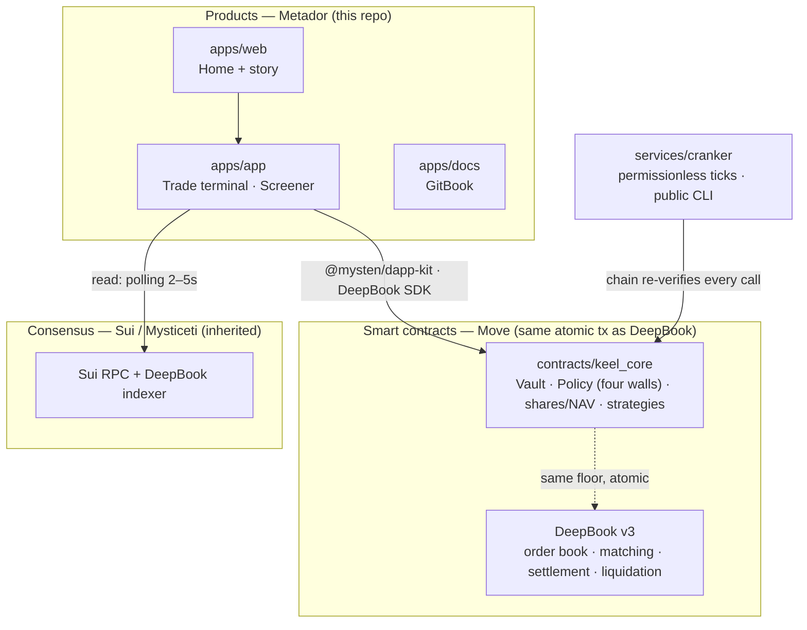

<div align="center">

# Metador

### The consumer layer for **DeepBook Margin** on Sui

**Hyperliquid-grade leverage trading UX on a non-custodial, on-chain margin market.**
DeepBook owns matching, settlement, and liquidation. Metador owns the terminal, the
risk presentation, and the flows — so traders get top-venue speed and clarity while
custody and liquidation stay on the protocol, never with an operator.

[](https://sui.io)
[](https://deepbook.tech)
[](https://nextjs.org)
[](https://www.typescriptlang.org)
[](https://turbo.build)
[](#status--safety)

</div>

---

## Table of contents

- [The problem](#the-problem)
- [What Metador is](#what-metador-is)
- [Layer guardrail — what we build vs. what DeepBook owns](#layer-guardrail)
- [Architecture](#architecture)
- [Money-safety law](#money-safety-law)
- [On-chain: the `keel_core` Move package](#on-chain-the-keel_core-move-package)
- [Repository layout](#repository-layout)
- [Getting started](#getting-started)
- [Verified testnet anchors](#verified-testnet-anchors)
- [Error UX — the abort-code dictionary](#error-ux--the-abort-code-dictionary)
- [Roadmap](#roadmap)
- [How this was built — KAIOS](#how-this-was-built--kaios)
- [Status & safety](#status--safety)
- [License & originality](#license--originality)

---

## The problem

Centralised perp and margin venues own the trading experience — fast order books,
clean charts, instant fills — **but they hold your funds.** On-chain venues are
non-custodial **but unusable** as consumer products.

DeepBook Margin closes the infrastructure gap: a fully on-chain order book with
matching, settlement, interest, and liquidation. **Nobody has yet built the consumer
terminal on top of it.** That terminal is Metador.

## What Metador is

A leveraged trading terminal — order book, candlestick chart, leverage entry, open
positions with **live liquidation price, health factor, and PnL** — running against a
non-custodial, on-chain margin market. The trader gets the experience of a top desk;
the protocol keeps custody and liquidation.

**Surfaces**

| Surface | Path | What it is |
|---|---|---|
| **Trade terminal** | `apps/app` · `/trade/[market]` | Order book + depth, chart, leverage order entry, positions/PnL/liquidation |
| **Screener** | `apps/app` · `/screener` | Market discovery with margin columns and a comparison view |
| **Home** | `apps/web` | The story: the custody problem, the safety model, waitlist |
| **Docs** | `apps/docs` | GitBook knowledge base (concepts, developers, safety) |

> **Honest status.** The terminal is built to benchmark grade on a typed mock domain
> (`apps/app/lib/mock-margin.ts`) while the live DeepBook **Margin** SDK integration is
> wired in. The non-custodial vault/policy contracts (`contracts/keel_core`) are fully
> implemented and unit-tested on testnet. See [Status & safety](#status--safety).

## Layer guardrail

The single most important boundary in this codebase. **A diff that crosses it is wrong
by definition.**

| DeepBook owns (we call, never rebuild) | Metador builds |
|---|---|
| Custody (`BalanceManager`) | The terminal UI |
| Matching & settlement | Order / position / risk presentation |
| Order book & price oracles | Margin-manager flows (create · deposit · borrow · repay · withdraw) via the SDK |
| **Liquidation** & interest | Screener, home, product polish |
| The margin-manager primitive | Money-safe formatting, abort decoding, analytics |

We never write matching engines, settlement, oracles, or liquidation logic — that is
DeepBook's layer.

## Architecture

Four layers, two of them inherited from Sui & DeepBook:



Visual source of truth lives in [`docs/diagrams/`](docs/diagrams) (system architecture,
trade flow, deposit/withdraw/crank, Move object model, page routing).

### Tech stack

| Concern | Choice |
|---|---|
| Contracts | **Sui Move**, edition 2024 — the only audited surface |
| Frontend | **Next.js** (App Router), **TypeScript strict**, Tailwind on custom design tokens |
| Animation | **Motion** (motion.dev) — single animation library; `lightweight-charts` for candles |
| Sui / DeepBook | `@mysten/dapp-kit`, `@mysten/sui`, **DeepBook v3 SDK** |
| Services | `services/cranker` — plain Node + TS worker, untrusted by design |
| Tooling | **pnpm** workspaces + **Turborepo**, Vitest, Playwright, PostHog |

## Money-safety law

This product touches funds, so the rules are absolute and enforced in code:

- **All money is `bigint` base units, end-to-end.** Floats never touch balances,
  prices, PnL, health, interest, or liquidation math. Decimals come from on-chain coin
  metadata.
- **Every financial calculation ships known-answer unit tests** (NAV, shares, fees,
  liquidation price, health factor).
- **Simulate before signing.** Every transaction is `dryRun`'d and exact effects shown
  before a signature is requested; indexer lag is accounted for.
- **Liquidation price is always visible** on open positions.
- **Claim discipline.** We say "funds cannot be stolen; losses are capped by your
  ceiling" — never "you can't lose money." No earnings promises anywhere.
- **Testnet only** until the founder writes "go mainnet" in the decision log.

## On-chain: the `keel_core` Move package

A small (~900 LoC) original Move package — the non-custodial foundation. It locks a
DeepBook `TradeCap` at vault birth and enforces **four policy walls** that the chain
re-checks before *any* DeepBook call:

| Wall | Guarantee |
|---|---|
| **Budget** | An order cannot exceed the vault's ceiling. |
| **Scope** | A vault may only trade its one allowed market. |
| **Expiry** | The mandate stops at a real timestamp. |
| **Revocation** | The owner can revoke instantly; funds stay safe and withdrawable. |

Modules: `vault` (shares ledger, deposit/withdraw, locked `TradeCap`, revoke) ·
`shares` (pure NAV/shares math, known-answer tested) · `delegate` · `dca`
(permissionless tick, walls re-checked) · `agent_mandate` (the verified testnet spike).
Backed by **60+ Move unit tests with full abort-path coverage**; every abort maps to a
human message via [`docs/abort-codes.md`](docs/abort-codes.md).

> Per [ADR-007](docs/decisions/007-v4-margin-pivot.md), `keel_core` (the spot-vault
> thesis) is **shelved, not deleted** — the v4 product is the DeepBook Margin terminal.
> The package remains as proven, tested, non-custodial infrastructure.

## Repository layout

```
metador/
├── apps/
│   ├── app/          # the product: trade terminal, screener, portfolio, safety
│   ├── web/          # marketing home + story
│   └── docs/         # GitBook knowledge base
├── contracts/
│   └── keel_core/    # Move — Vault, Policy (four walls), shares/NAV, strategies, tests
├── services/
│   └── cranker/      # Node + TS worker: permissionless ticks + public CLI
├── packages/
│   ├── ui/           # shared components (DataTable, primitives)
│   ├── design-system/# frozen design tokens — consumed by both apps
│   ├── deepbook/     # DeepBook SDK glue, constants, money formatting + abort decoding
│   ├── analytics/    # the single analytics event registry
│   └── reference-lab/# benchmark capture + measurement tooling
├── docs/             # diagrams, decisions (ADRs), abort-codes, research distillates
├── mind/             # the build journal — every step recorded
└── PRODUCT.md · ARCHITECTURE.md · DESIGN.md · CLAUDE.md   # standing source-of-truth docs
```

## Getting started

**Prerequisites**

- **Node ≥ 22** and **pnpm 9.14+** (`corepack enable`)
- **Sui CLI** (for the Move contracts) — [install](https://docs.sui.io/guides/developer/getting-started/sui-install)
- A Sui wallet (e.g. Sui Wallet / Suiet) on **testnet**

**Install & run**

```bash
pnpm install            # install the whole workspace

pnpm dev                # run all apps (Turborepo) — web + app
pnpm --filter @metador/app dev    # run just the trade terminal
pnpm --filter @metador/web dev    # run just the home
```

**Quality gates** (the definition of done for every change)

```bash
pnpm typecheck          # TypeScript strict, no `any` on money paths
pnpm lint
pnpm test               # Vitest — unit tests on all money-formatting paths
pnpm build              # production build (LCP/CLS budgets enforced)
```

**Contracts**

```bash
cd contracts/keel_core
sui move test           # 60+ unit tests, abort-path coverage

# optional: seed DeepBook objects on testnet
pnpm setup:contracts
```

## Verified testnet anchors

Re-verified before any mainnet move. Source: DeepBook v3 SDK `constants.ts`.

| Object | ID |
|---|---|
| DeepBook package | `0x22be4cade64bf2d02412c7e8d0e8beea2f78828b948118d46735315409371a3c` |
| Registry | `0x7c256edbda983a2cd6f946655f4bf3f00a41043993781f8674a7046e8c0e11d1` |
| SUI / DBUSDC pool | `0x1c19362ca52b8ffd7a33cee805a67d40f31e6ba303753fd3a4cfdfacea7163a5` |
| DEEP / SUI pool | `0x48c95963e9eac37a316b7ae04a0deb761bcdcc2b67912374d6036e7f0e9bae9f` |
| Clock | `0x6` |

## Error UX — the abort-code dictionary

A failed transaction must never show a raw abort code. [`docs/abort-codes.md`](docs/abort-codes.md)
is the single source of truth: every on-chain abort maps to a plain-English message,
and `/risk-review` checks the Move constants and the UI table stay in sync. Example:

> `ERevoked` → *"This vault was revoked by its owner. Funds are safe and withdrawable."*

## Roadmap

| Phase | Focus | Exit |
|---|---|---|
| **P0** | Foundations: tokens, benchmarks, margin primitives, app shell, DeepBook spike | Spike passes on testnet with known-answer liquidation/health tests |
| **P1** | Core loop: discover → connect → deposit → leverage → position/PnL/liquidation → withdraw | Founder completes the cycle on testnet in the UI |
| **P2** | Differentiation: live screener, polished home + waitlist, copy-trading, profiles/leaderboard | — |
| **P3** | Launch prep: GitBook docs, analytics, perf, `/risk-review` of every funds path, guarded mainnet | External office-hours reviews + caps enforced in Move + founder sign-off |

Full detail in [`PRODUCT.md`](PRODUCT.md) and [`docs/decisions/`](docs/decisions).

## How this was built — KAIOS

Metador is built by **KAIOS**, an AI operating system that runs inside the repo: a
founding team of specialised subagents (`product`, `design`, `protocol`, `frontend`,
`growth`), review commands (`/risk-review`, `/design-review`, `/arch-review`), a frozen
design-token system, and a **reference lab** that measures world-class benchmarks and
ships only principles — never their assets. The discipline is recorded in
[`CLAUDE.md`](CLAUDE.md), the decision log ([`docs/decisions/`](docs/decisions)), and a
per-step build journal under [`mind/`](mind). Everything ships in small, verifiable
increments behind hard quality and money-safety gates.

## Status & safety

- 🟡 **Testnet only.** No mainnet deployment. No real funds. Caps and fees-off are
  enforced in Move before any mainnet move.
- This is **not financial advice** and contains **no earnings promises**. Leverage is
  real risk: positions can be liquidated and losses can be total. Risk is disclosed
  before the first leveraged action; liquidation price is always visible.
- Private keys and seed phrases are never requested, stored, or logged. All signing
  happens in the user's connected wallet. Any addresses in this repo are **disposable
  testnet keys**.

## License & originality

Metador is an **original brand and implementation**. Per the project's Reference
Extraction Protocol, competitor study yields only measurements, structures, and
principles written in our own words — never their fonts, images, copy, or palettes.
A stranger seeing Metador beside any benchmark reads two different products.

> Licensing is finalised before mainnet; until then the code is shared for hackathon
> review. See [`docs/decisions/`](docs/decisions) for the open compliance items.
