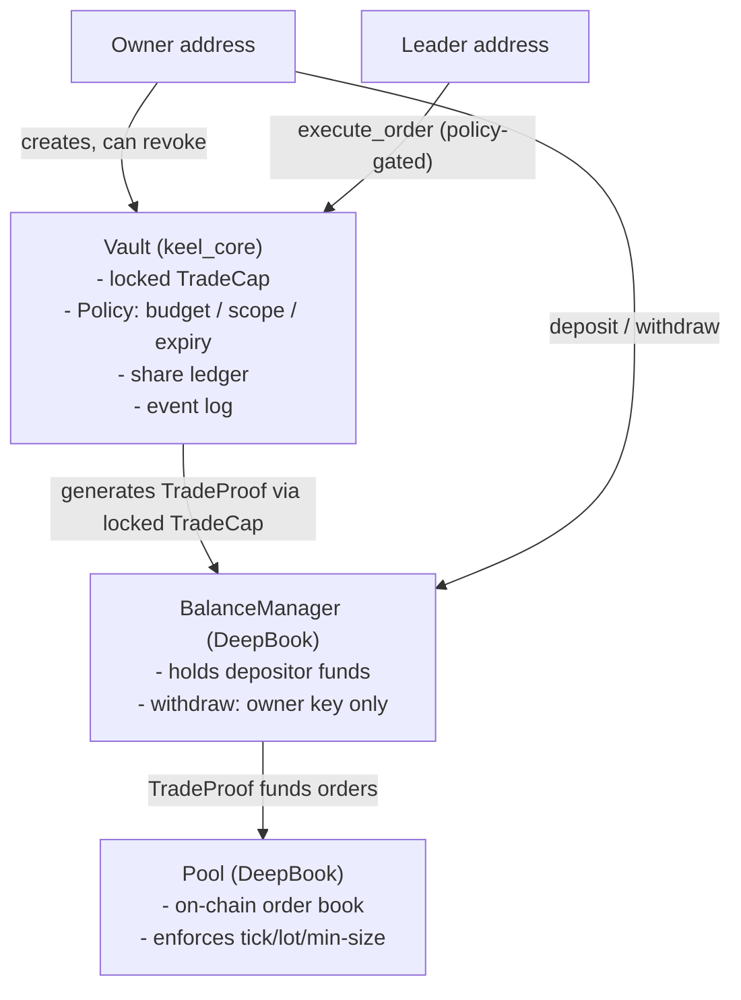

# Architecture

Metador is built on two on-chain layers — Sui/DeepBook (inherited) and `keel_core` (ours) — plus a thin product layer.

## Object relationships

The three core objects and how they relate:

The Vault sits between the leader and DeepBook. The leader calls `execute_order` on the Vault, which runs all four wall checks, generates a `TradeProof` from the locked TradeCap, and passes that proof to DeepBook's `place_limit_order`. DeepBook validates the proof against the BalanceManager and executes or rejects the order. The leader never touches the BalanceManager directly.

## The four layers

1. **Consensus** — Sui/Mysticeti. Inherited. Not our code.
2. **Exchange** — DeepBook v3. Inherited. Provides BalanceManager, TradeCap, Pool, order placement. Not our code.
3. **Vault layer** — `contracts/keel_core`. Ours. ~900 LoC target. Vault, Policy, Delegate + DCA strategies, shares/NAV, events.
4. **Product** — `apps/app` (trading interface), `apps/web` (landing), `services/cranker` (DCA cron worker). Our code, no on-chain trust.

## What Metador builds vs. what Metador calls

| Component | We build? | Source |
|---|---|---|
| BalanceManager custody | No | DeepBook |
| Order matching/settlement | No | DeepBook |
| TradeCap/TradeProof mechanics | No | DeepBook |
| Vault object + four walls | Yes | keel_core |
| shares/NAV accounting | Yes | keel_core |
| DCA/Delegate strategies | Yes | keel_core |
| Cranker worker | Yes | services/cranker |
| Trading UI + wallet connect | Yes | apps/app |

## Services

`services/cranker` is a ~300-line Node/TypeScript worker. It triggers due DCA ticks and mandate expiry sweeps on a cron schedule. It is untrusted by design — the chain validates every call it submits. Anyone can run `npx metador-crank` to execute the same calls; Metador does not have exclusive cranking rights.

## Data layer

v1 reads from the DeepBook official indexer and direct Sui RPC polling (2–5s intervals). No Metador-owned database or WebSocket server in v1. A `metador-indexer` service (NestJS + Postgres + WebSocket) is planned for G4 when polling no longer scales.

## Next

[Testnet IDs](testnet-ids.md) — all verified on-chain addresses for testnet integration.
